# Animal_pose_GUI
## Environment Setup
This project requires three separate Python virtual environments to function correctly.
We have tested the code on Ubuntu 22.04 with RTX 4080.
 Please follow the steps below to set up each environment.

1. **Foundation Stereo Environment**:
   Follow the instructions in the [FoundationStereo README](FoundationStereo/readme.md) to set up the Foundation Stereo environment. This environment is necessary for depth computation.

2. **SAM2 Environment**:
   Follow the instructions in the [SAM2 README](sam2/README.md) to set up the SAM2 environment. This environment is used for animal detection and tracking.

3. **Point-SAM Environment**:
    Follow the instructions in the [Point-SAM README](Point-SAM/README.md) to set up the Point-SAM environment. This environment is used for embedding extraction and visualization.

4. **GUI Environment**:
    The GUI environment can be configured with reference to [GUI Environment](gui/GUI.yaml).

## Usage Instructions
### Create or Load a Project

To start using the GUI, go to the `gui` folder and run the `main_gui.py` file. You will be presented with a window that allows you to either create a new project or load an existing one. The complete file structure and the contents of each subfolder can be found in the example project.
When creating a new project, you will need to provide a project name, an experimenter name and the number of cameras. The project folder will be created in the root folder and contain all the necessary subfolders and configuration files for your project. After that, open the `config.json` in new project and store the path of the python interpreter under the GUI environment into the "Env_Path" in it.

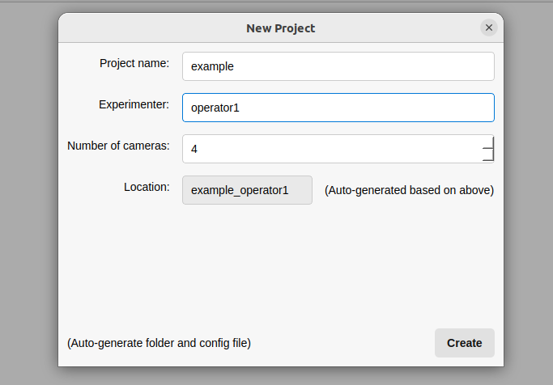

Create a new project

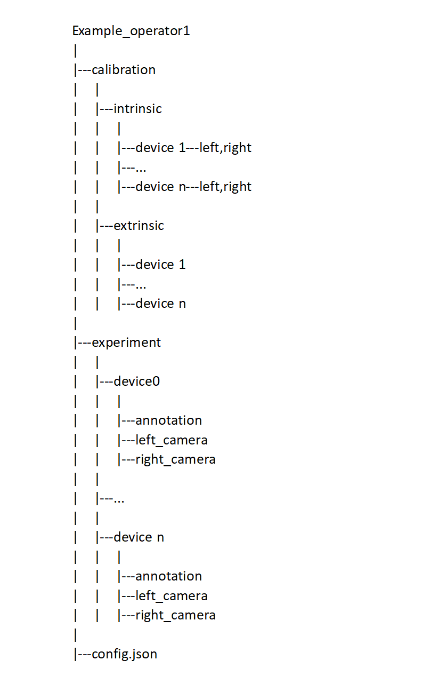

The structure of new project

If you find any problems about the structure of data, you may download an example project(processed data) via this link: https://drive.google.com/file/d/1PC_3cX9a40iiUJX_KnKKg9o1HN8fD4sV/view?usp=sharing

### Intrinsic Calibration

First, we need to calibrate the intrinsic parameters of each camera. This is done using a checkerboard calibration board. The photos of the calibration board should be taken by each camera in different poses to ensure accurate calibration.
Store the photos in the corresponding "device" folders, ensuring that the photos of the two cameras in one device are in the same order. Then, supplement the corresponding parameters in the `config.json` file under "Calibration_Info" > "Intrinsic". The parameters include:
- `Checkerboard_Corner_Spacing`: The size of the grid of the checkerboard calibration board.
- `Inner_Corner_Array_Size`: The number of inner corner points on the calibration board.

After filling in the parameters, return to the main page, select the "intrinsic" folder of the project you want to calibrate, and click "calibrate". The results will show the reprojection error of the intrinsic parameter calibration for each camera and the stereo calibration for the two cameras in the same device. After calibration, you can see the stereo rectification results under each "device" folder.

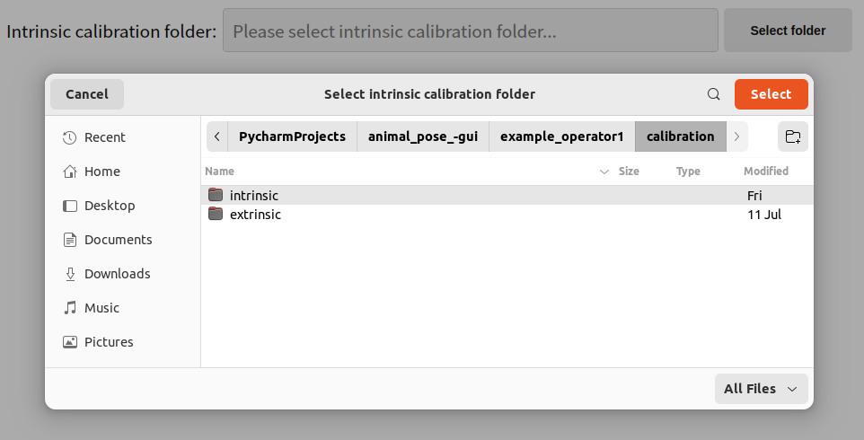

Load intrinsic calibration images

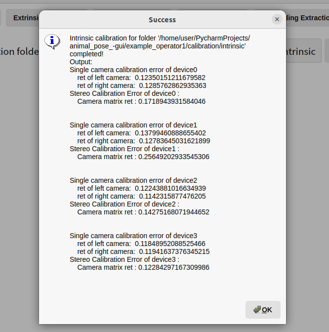

Intrinsic calibration results

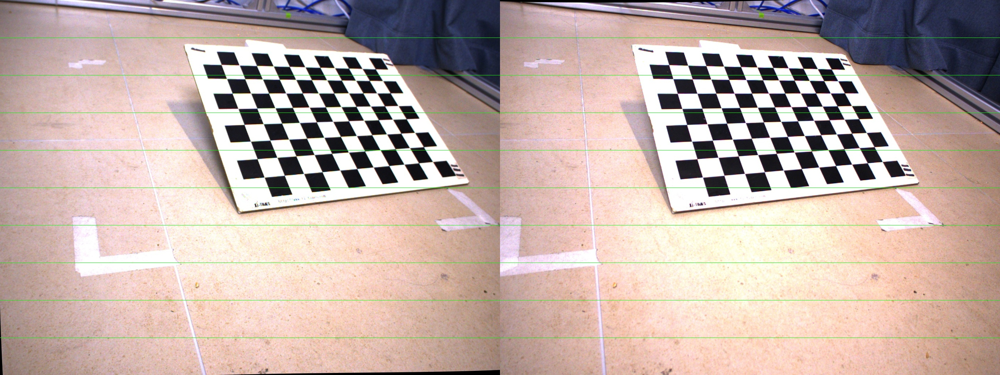

Stereo rectification results

### Extrinsic Calibration

After the intrinsic calibration is completed, we can proceed to extrinsic calibration. Extrinsic calibration is used to compute the relative transformations of multiple devices. It is essential to ensure that the data from different devices can be accurately fused.
To perform extrinsic calibration, you need to prepare a set of images that capture a AprilGrid calibration board from the left camera of each device. The calibration board should be placed within the field of view of all devices. The parameters for extrinsic calibration are specified in the `config.json` file under "Calibration_Info" > "Extrinsic":
- `April_Grid_Size`: The specification of the Apriguard calibration board.
- `April_Size`: The size of the large grid on the calibration board.
- `April_Interval`: The size of the small grid on the calibration board.
- `April_Family`: The family of the calibration board.

After filling in the parameters, store these photos in their respective "device" folders. Once done, select the "extrinsic" folder of the project you want to calibrate and click "calibrate". After successful operation, you will see the reprojection error of the extrinsic parameter calibration between various devices.

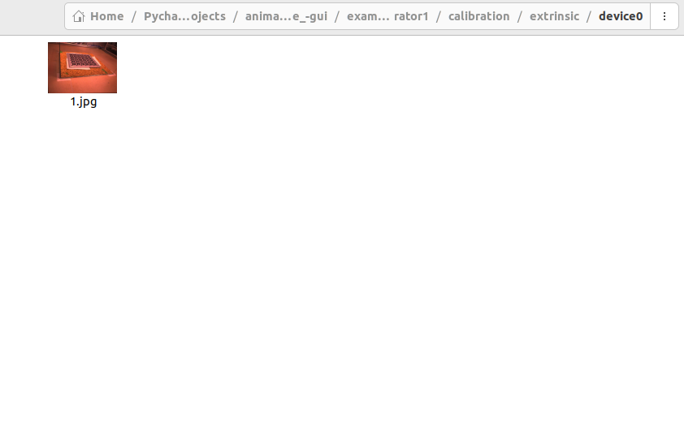

Load extrinsic calibration images

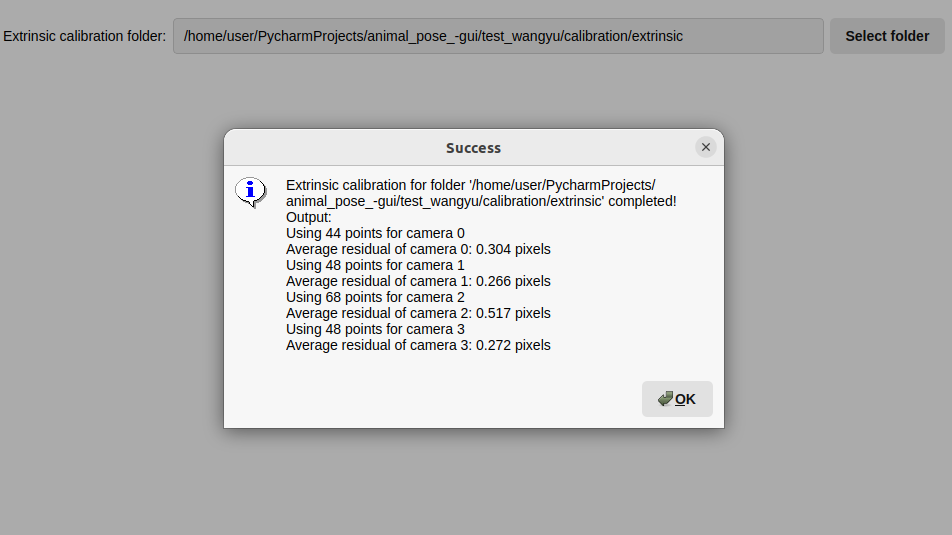

Extrinsic calibration results

### Depth Computation

Once the intrinsic and extrinsic parameters are calibrated, we can proceed to depth computation. This step requires the Foundation Stereo environment.

First, store the captured data in the specified format: Put the video frames captured by each device into "left_camera" and "right_camera" respectively. Note that the video frames of the left and right cameras at the same time should have the same name. Then, store the path of the python interpreter under the local foundation stereo environment into "Depth_Computation" > "Env_Path" in the config file, and write the path of the pretrained weight file into "Ckpt_Path". Then, on the GUI interface, select the "experiment" folder in the project to be processed and click "rectify". The photos after epipolar line correction will be stored in "left_camera_rectified" and "right_camera_rectified". Then, click "compute" to compute the depth map of each video frame, which will be stored in the "depth" folder. At the same time, the visualized depth maps will be stored in "vis_depth".

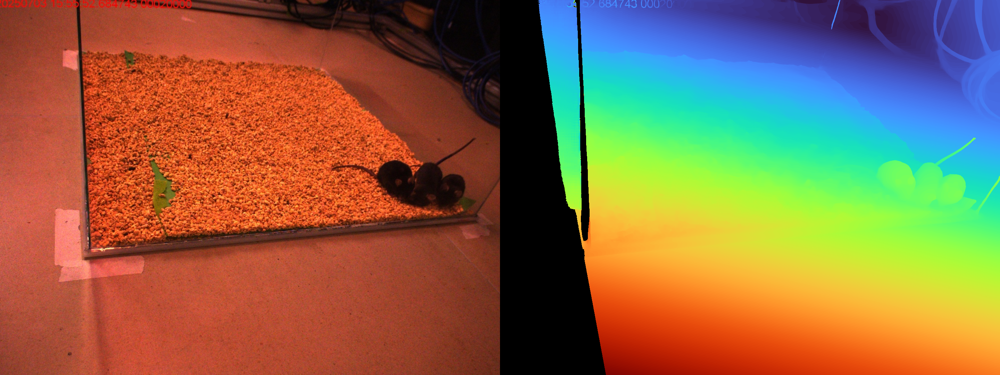

Visualized depth map

### Animal Detection

After the depth computation is completed, we can proceed to animal detection. This step requires the SAM2 environment. Store the path of the python interpreter under the local SAM2 environment into "Animal_Detection" > "Env_Path" in the config.json file, and write the path of the pretrained weight archive file into "Ckpt_Path". 

On the GUI interface, select the "experiment" folder in the project to be processed.
We need to first annotate the first frame of each video. Click "annotation first frame" to open the first frame of the video. In the popped-up window, click on the pixels that belong to the animal. The default ID is 1. If there are two animals, you can manually press 2 and then select the pixels belonging to the second animal, and so on. Press 0 to select the background pixels. After finishing, press Q to exit. The obtained mask will be stored in the "annotation" folder.
Then click "detect". The code will automatically extract masks from each video frame. If there are suspected errors during detection, a window will pop up for manual judgment. If there is indeed an error, it will be automatically refined until all video frames are processed.

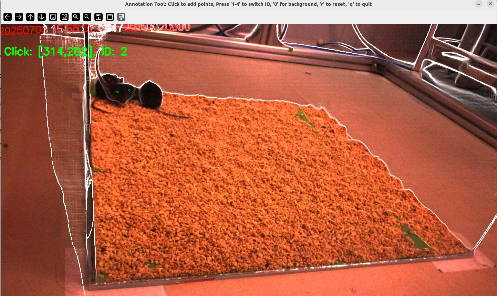

Annotate the first frame of the video

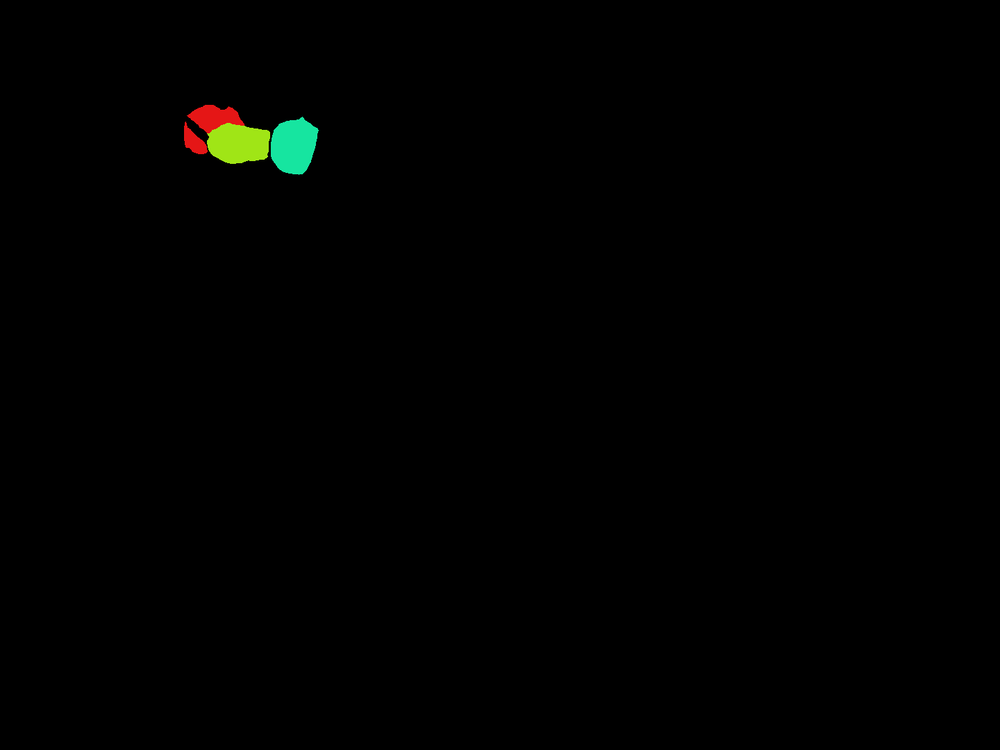

Animal detection results

### Embedding Extraction

The final step is embedding extraction and visualization, which requires the Point-SAM environment. Store the path of the python interpreter under the local Point_sam environment into "Embedding Extraction" > "Env_Path" in the config.json file, and write the path of the pretrained weight file into "Ckpt_Path". 

On the GUI interface, select the "experiment" folder in the project to be processed, then click the three buttons in sequence, and wait for the success prompt. The point cloud will be generated in "point cloud" under the "experiment" folder, and the embedding results will be generated in the "embeddings" folder. Finally, click "UMAP and Visualize" to generate an interactive UMAP graph.

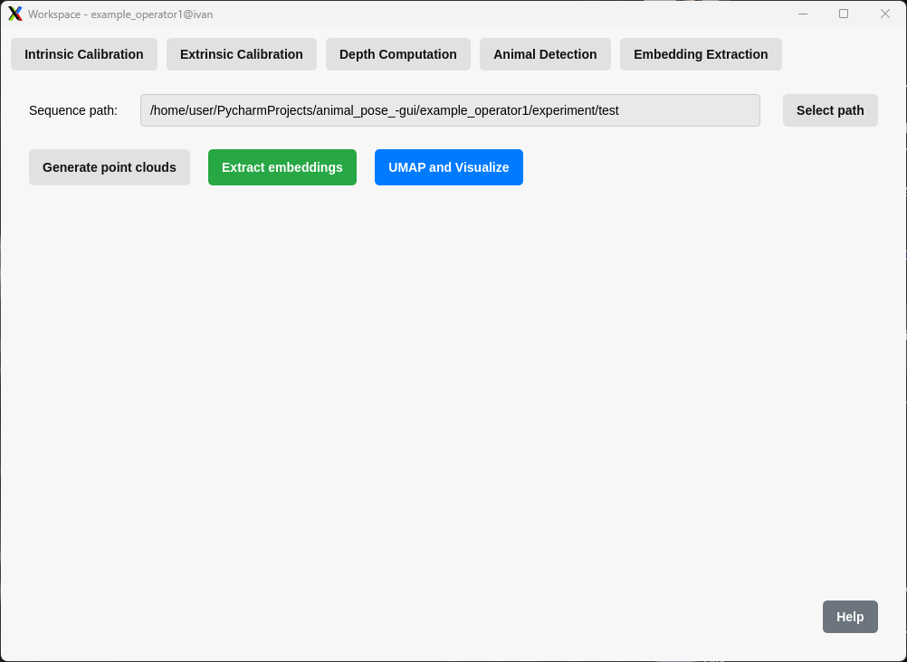

Embedding extraction page

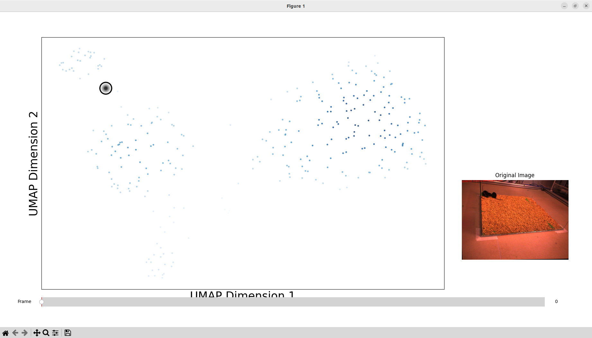

UMAP visualization results  

